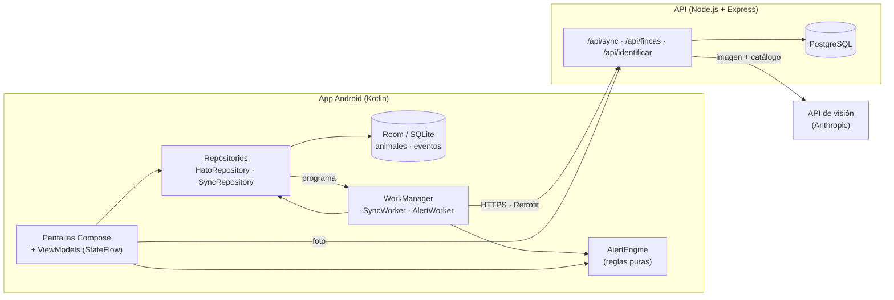
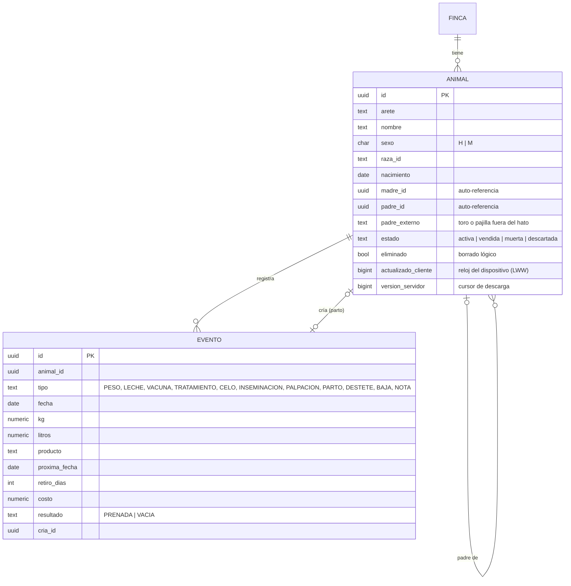
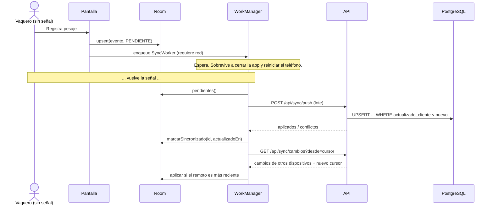
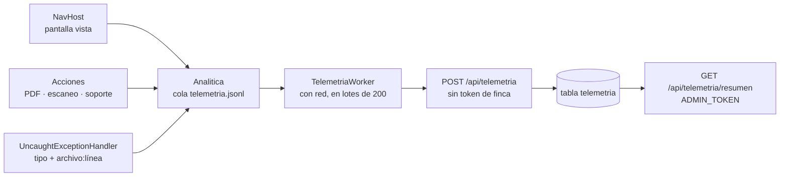

# Arquitectura de Bobinapp

## Vista general

Capas de la app:

| Capa | Paquete | Responsabilidad |
|---|---|---|
| UI | `ui/*` | Pantallas Compose. Cada pantalla tiene un ViewModel que expone un único `StateFlow` de estado. |
| Dominio | `domain/` | `HatoCalculos` y `AlertEngine`: reglas zootécnicas puras, sin dependencias de Android. Probadas con JUnit. |
| Datos | `data/local`, `data/remote`, `data/repository` | Room (fuente de verdad), Retrofit (nube) y repositorios que coordinan ambos. |
| Trabajo en segundo plano | `work/` | `SyncWorker`, `AlertWorker`, notificaciones y programación con WorkManager. |
| Dependencias | `di/AppContainer.kt` | Inyección manual: un único lugar donde se construye todo el grafo. |

## Modelo de datos

Decisiones:

- **Un solo tipo de tabla para eventos** (herencia de tabla única). Pesajes, vacunas y partos comparten la línea de tiempo del animal y se consultan juntos; las columnas propias de cada tipo son opcionales y se validan en la app y en el servidor (`zod`).
- **Genealogía por auto-referencia.** `madre_id` y `padre_id` apuntan a la misma tabla. Si el toro no es del hato (inseminación con pajilla), se guarda en `padre_externo`. Los ancestros se obtienen con una CTE recursiva en SQLite (`AnimalDao.ancestros`).
- **Sin llaves foráneas en los datos sincronizados.** En una sincronización, la cría puede llegar antes que su madre y SQLite rechazaría la fila. Se usan índices y se acepta integridad eventual; la UI muestra "Sin registro" mientras falte un progenitor.
- **Borrado lógico** (`eliminado = true`) para que un borrado también se propague a los demás dispositivos.
- **Fechas como texto ISO** en SQLite, así ordenan y comparan bien en SQL (`GROUP BY fecha`, `fecha >= :desde`).

## Modo sin conexión y sincronización

Patrón *outbox*: cada fila tiene `syncEstado` (`PENDIENTE` o `SINCRONIZADO`). La cola es simplemente "todas las filas pendientes".

Reglas:

1. **Escribir local primero.** La interfaz nunca espera a la red.
2. **Conflictos: gana el más reciente** (*last-writer-wins*) según `actualizadoEn`, que pone el dispositivo. El servidor solo sobrescribe si el cambio entrante es más nuevo, y un empate se resuelve a favor del servidor para que todos converjan.
3. **Cursor del servidor para descargar.** El pull no usa el reloj del teléfono sino `version_servidor`, una secuencia de PostgreSQL. Así un teléfono con la hora mal puesta no hace que otro se salte cambios.
4. **Push serializado por finca** con `pg_advisory_xact_lock`, para que las versiones se confirmen en orden y un pull concurrente no se salte filas.
5. **No perder ediciones hechas durante la subida.** `marcarSincronizado` solo marca si `actualizadoEn` no cambió desde que se leyó la fila.
6. **Datos de ejemplo** (`esDemo`) nunca entran a la cola.

## Fotos de los animales

La foto no viaja dentro de la fila del animal: los bytes irían en cada pull y un hato de 300 reses con foto haría pesada cada sincronización. En su lugar:

| Dato | Dónde vive | Para qué |
|---|---|---|
| `fotoActualizadaEn` | Fila del animal (Room y PostgreSQL), se sincroniza | Versión de la foto vigente |
| `fotoLocalEn` | Solo en el teléfono | Versión del archivo guardado aquí |
| `fotoPendiente` | Solo en el teléfono | Falta subir la foto tomada aquí |
| Bytes JPEG | `filesDir/fotos/<id>.jpg` y tabla `fotos_animal` | La imagen |

1. Al tomar la foto se guarda el archivo, se pone `fotoActualizadaEn = fotoLocalEn = ahora` y `fotoPendiente = true`.
2. `SyncWorker` sube primero las filas y después las fotos pendientes (`PUT /api/fotos/:id`). El servidor verifica la firma real del archivo y solo reemplaza si la versión es más nueva.
3. Tras el pull, se descargan las fotos donde `fotoLocalEn < fotoActualizadaEn`.
4. Si llega un cambio remoto del animal mientras aquí hay una foto nueva sin subir, `ReglasSync.fusionarAnimal` conserva la foto local y deja la fila pendiente.

La base de Room pasó a la versión 2 con una migración (`MIGRACION_1_2`) que agrega las columnas sin borrar datos; en PostgreSQL es `002_fotos_animales.sql`.

## Reporte PDF de trazabilidad

`ReporteTrazabilidad` dibuja la ficha de un animal en páginas A4 con `android.graphics.pdf.PdfDocument`, sin librerías: encabezado con el logo, foto recortada al centro, datos, genealogía de 3 generaciones, pesajes con ganancia diaria, sanidad (vacunas, tratamientos, costos), reproducción y resumen de leche. Una clase interna (`Lienzo`) lleva la posición vertical, parte los textos largos en líneas y abre una página nueva cuando no cabe la siguiente fila; cada página lleva pie con el arete y el número de página.

El archivo se guarda en `cacheDir/reportes/` y se comparte con `FileProvider` e `Intent.ACTION_SEND`, así que funciona sin señal y se puede mandar por WhatsApp o correo. El prototipo web hace lo mismo escribiendo el PDF a mano (objetos, tabla `xref`, fuentes Helvetica y la foto JPEG incrustada con `DCTDecode`).

## Alertas en segundo plano

`AlertEngine` recibe el hato y la fecha y devuelve alertas con una **clave estable** (por ejemplo `palp:<id de la inseminación>`). La misma situación siempre produce la misma clave, lo que permite:

- descartar una alerta sin que reaparezca,
- no repetir la misma notificación (`AlertWorker` guarda las claves ya notificadas).

| Regla | Cálculo |
|---|---|
| Inseminar hoy | Celo registrado hace ≤ 1 día y sin inseminación posterior (regla AM/PM). |
| Celo esperado | Último celo + 21 días × n, avisa 3 días antes. |
| Diagnóstico de preñez | Inseminación + 35 días sin palpación. |
| Retorno a celo | Inseminación + 21 días (±2). |
| Parto próximo / atrasado | Inseminación confirmada + 283 días. |
| Secar vaca | Parto estimado − 60 días, si está en ordeño. |
| Dosis pendiente | `proximaFecha` de vacunas y tratamientos, agrupadas por producto y fecha. |
| Retiro de leche y carne | Fecha del tratamiento + días de retiro. |
| Destete | Nacimiento + 240 días. |
| Pesaje pendiente | Animal en crecimiento sin pesaje en 45 días. |

`AlertWorker` corre cada 6 horas (y después de cada cambio local) y notifica solo lo vencido o para hoy.

## Arranque

`MainActivity` instala la pantalla inicial (`androidx.core:core-splashscreen`) antes de `super.onCreate` y la mantiene con `setKeepOnScreenCondition` solo hasta que Room entrega el hato, con un tope de 2 s. Así nunca se ve una pantalla vacía y nunca se queda pegada. El tiempo desde que nace el proceso (`Process.getStartElapsedRealtime`) hasta ese momento se registra como `inicio_app`, y el resumen de analítica da su p50 y p90.

## Seguridad

| Capa | Medida |
|---|---|
| Token en el teléfono | AES-256-GCM con llave del Android Keystore (`CifradoLocal`). Un token viejo en texto plano se migra solo la primera vez que se lee. |
| Copia de seguridad | `reglas_respaldo.xml` excluye las preferencias: el token cifrado no serviría en otro teléfono. |
| Acceso a la app | Bloqueo opcional con `BiometricPrompt` (BIOMETRIC_WEAK + DEVICE_CREDENTIAL). Se pide al abrir y tras 1 minuto en segundo plano; activarlo o quitarlo también exige identificarse. |
| Red | `network_security_config`: en release solo HTTPS (y la URL por defecto es la de Render); en debug se permite HTTP para probar en la red local. |
| API | Token de 256 bits guardado como SHA-256, aislamiento por finca en cada consulta, límite de peticiones por IP en rutas sin token, cabeceras `nosniff`/`DENY`/`no-referrer`/HSTS y clave de administrador comparada en tiempo constante. |

## Notificaciones

`PoliticaNotificaciones.decidir` (código puro con pruebas) recibe las alertas, las ya notificadas, las categorías apagadas, el silencio nocturno y la hora, y devuelve qué notificar y qué recordar. Hay un canal de Android por categoría (`alertas_reproduccion`, `alertas_salud`, `alertas_manejo`), así que también se pueden apagar desde los ajustes del sistema. En silencio nocturno nada se marca como notificado: la siguiente revisión de la mañana lo envía.

## Analítica de uso

- **Anónima por diseño:** un UUID por instalación, sin relación con la finca. La petición no lleva el token (lo quita el interceptor de OkHttp) y el servidor no guarda la IP. El esquema de `zod` solo acepta identificadores cortos (`^[a-z][a-z0-9_]*$`) como nombres de evento y pantalla, para que no se cuelen textos libres.
- **No pierde eventos:** la cola vive en un archivo y solo se recorta lo que el servidor confirmó. Un error fatal se escribe en el mismo hilo antes de que el proceso muera.
- **Controlable:** si se apaga en Ajustes, se borra la cola y no se registra nada; "Borrar mis estadísticas" llama a `DELETE /api/telemetria/:instalacion` y genera un id nuevo.
- **Resumen:** instalaciones activas, pantallas más vistas, acciones, errores agrupados por tipo y lugar, tiempo de arranque (p50/p90) y versiones en uso.

## Escáner de razas

La foto se reduce a 1280 px y JPEG 85 % en el teléfono y se envía a `POST /api/identificar`. El servidor la pasa a un modelo de visión junto con el catálogo de razas y valida la respuesta: los ids que no existen en el catálogo se descartan y la confianza se acota a 0–100. La llave del modelo vive solo en el servidor.
